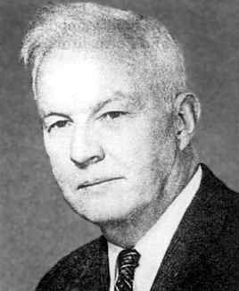
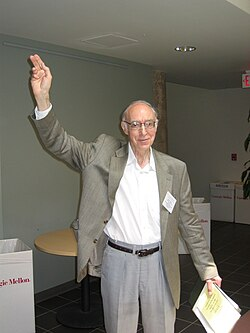

# Curry and Howard

The **Curry-Howard correspondence** — the identification of propositions with types and proofs with programs — is named after two people: the mathematician **Haskell Curry** and the logician **William Alvin Howard**.

---

## Haskell Brooks Curry (1900–1982)

*Photo: MacTutor History of Mathematics*

**Born:** September 12, 1900, Millis, Massachusetts, USA
**Died:** September 1, 1982, State College, Pennsylvania, USA

### Life

Curry was the son of Samuel Silas Curry and Anna Baright Curry, who ran a School of Expression (elocution) in Boston. He entered Harvard in 1916 intending to study medicine, but switched to mathematics during World War I, graduating in 1920. After detours through electrical engineering (MIT) and physics (Harvard, M.A. 1924), he found his calling when he encountered Russell and Whitehead's *Principia Mathematica*.

In 1927, while at Princeton, Curry discovered the work of Moses Schönfinkel on combinatory logic — a system that eliminates the need for bound variables. This discovery shaped his entire career. He moved to Göttingen to work under David Hilbert, completing his Ph.D. in 1930 on combinatory logic.

Curry spent 37 years at Pennsylvania State College (1929–1966). During World War II, he worked at the Frankford Arsenal (where he invented a steepest-descent method for gradient optimization) and later on the ENIAC project at Aberdeen Proving Ground. In 1947, he described one of the first high-level programming languages.

After retiring from Penn State, he accepted a professorship at the University of Amsterdam (1966–1970), where he completed the second volume of his treatise on combinatory logic with Robert Feys and J.P. Seldin.

### Key contributions

- **Combinatory logic**: Developed the theory extensively from Schönfinkel's original idea
- **Curry's paradox** (1942): Showed that unrestricted self-reference leads to inconsistency
- **Currying**: The technique of converting a multi-argument function into a chain of single-argument functions (the concept was actually anticipated by Schönfinkel and Frege, but Curry's name stuck)
- **Curry-Howard correspondence**: The observation that proofs in intuitionistic logic correspond to terms in typed lambda calculus

### Legacy

Three programming languages are named after him: **Haskell**, **Brook**, and **Curry**. The concept of "currying" is ubiquitous in functional programming and type theory.

---

## William Alvin Howard (b. 1926)

*Photo: Wikimedia Commons, May 2004*

**Born:** 1926, USA

### Life

Howard earned his Ph.D. from the University of Chicago in 1956 under the supervision of Saunders Mac Lane (one of the founders of category theory), with a dissertation on *k-fold recursion and well-ordering*. He spent his career as a professor of mathematics at the University of Illinois at Chicago.

### Key contributions

- **The Curry-Howard correspondence** (1969, published 1980): In his manuscript *"The Formulae-as-Types Notion of Construction,"* Howard made precise the observation that:
  - **Propositions** in intuitionistic natural deduction correspond to **types** in simply typed lambda calculus
  - **Proofs** correspond to **terms** (programs)
  - **Proof normalization** corresponds to **computation** (β-reduction)

  This manuscript circulated informally from 1969 but was not formally published until 1980 in the Festschrift for Curry. It became one of the most influential ideas in the foundations of computer science and mathematics.

- **Ordinal analysis**: Howard was the first to carry out an ordinal analysis of the intuitionistic theory of inductive definitions. The **Howard ordinal** (also called the Bachmann-Howard ordinal) is named after him.

- Elected Fellow of the **American Mathematical Society**, 2018 class.

---

## The correspondence

Curry first noticed (in the 1930s–1950s) a structural similarity between combinatory logic and certain proof systems. Howard made this precise in 1969 by establishing a direct correspondence between natural deduction proofs and lambda calculus terms:

| Logic (Curry's side) | Computation (Howard's side) |
|---|---|
| Proposition | Type |
| Proof | Program (term) |
| Proof normalization | Computation (β-reduction) |
| Implication $A \to B$ | Function type $A \to B$ |
| Conjunction $A \land B$ | Product type $A \times B$ |
| Disjunction $A \lor B$ | Sum type $A + B$ |

This is the foundation of all modern proof assistants (Lean, Coq, Agda) and the conceptual backbone of HoTT Book Chapter 1, §1.11.

---

## Sources

- [Haskell Curry — Wikipedia](https://en.wikipedia.org/wiki/Haskell_Curry)
- [Haskell Curry — MacTutor History of Mathematics](https://mathshistory.st-andrews.ac.uk/Biographies/Curry/)
- [Haskell Curry — Britannica](https://www.britannica.com/biography/Haskell-Brooks-Curry)
- [William Alvin Howard — Wikipedia](https://en.wikipedia.org/wiki/William_Alvin_Howard)
